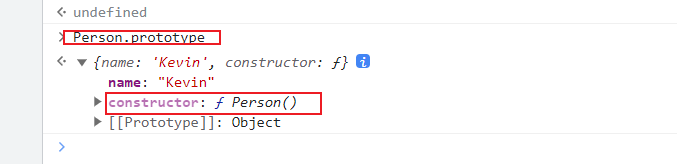
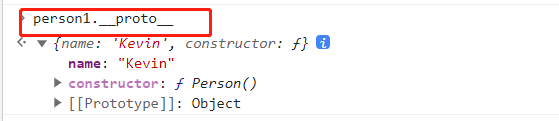
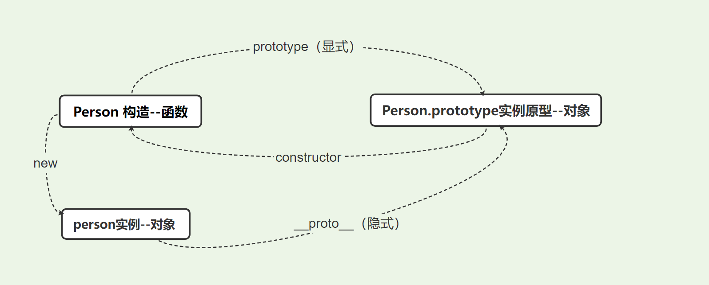
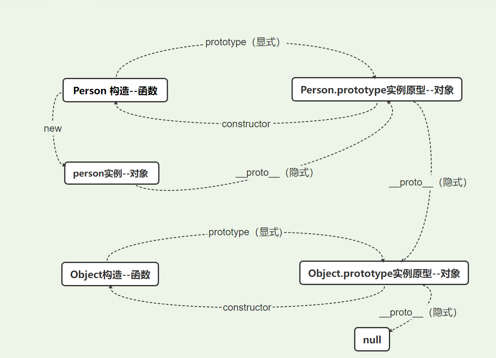

---
nav:
  path: /JavaScript
---

## JavaScript- 原型&原型链

- 首先需要明确,在 JavaScript 中万物皆对象，而对象出自构造器（构造函数）
- **\_\_proto\_\_**和**constructor**是**对象**(除了 null)独有的。
- **prototype**属性是**函数**独有的；
- 但是在 JavaScript 中，函数也是对象，所以函数也拥有**\_\_proto\_\_**和 **constructor**属性。

### 原型 prototype

<br/>

```jsx | pure
function Person() {
  this.age = 18;
}
// 虽然写在注释里，但是你要注意：
// prototype是函数才会有的属性
Person.prototype.name = 'Kevin';
var person1 = new Person();
var person2 = new Person();
console.log(person1.name); // Kevin
console.log(person2.name); // Kevin
```





然后你会发现构造函数的**prototype 属性**指向的是它的**原型对象**，而**原型**又通过**constructor**指向**构造函数**



### 原型链

- 原型其实也是一个对象，既然是**对象**，我们就可以用最原始的方式创建它

```jsx | pure
var obj = new Object();
obj.name = 'Kevin';
console.log(obj.name); // Kevin
```

其实**原型对象**就是通过 **Object 构造函数**生成的，结合之前所讲，实例的**\_\_proto\_\_** 指向**构造函数的 prototype** ，所以我们再更新下关系图：



图中由隐式原型**\_\_proto\_\_**组成的链路就是原型链.

### new 关键字

首先我们来看看 new 做了些什么？

- 创建一个新的对象
- 继承父类原型上的方法
- 添加父类的属性到新的对象上并初始化. 保存方法的执行结果.
- 如果执行结果有返回值并且是一个对象, 返回执行的结果, 否则, 返回新创建的对象。

<br/>

```jsx | pure
function _new (obj,...rest){
  cosnt newObj = Object.create(obj.prototype)
  const result = obj.apply(newObj, rest);
  return typeof result === 'object' ? result : newObj;
}
```
