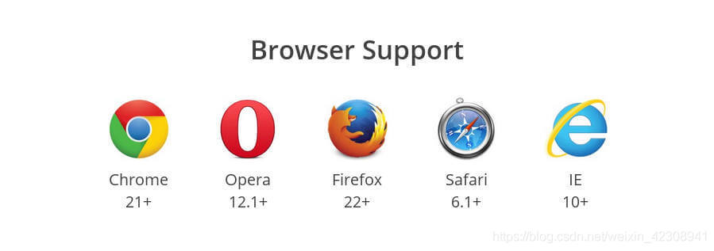
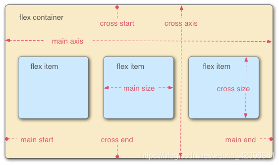
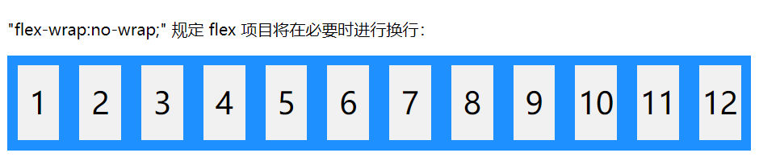
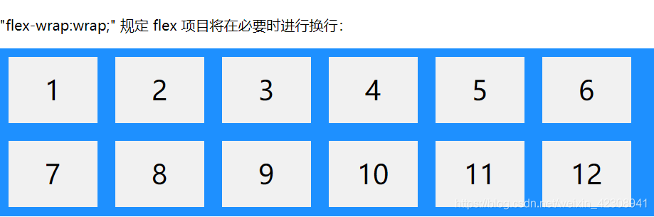
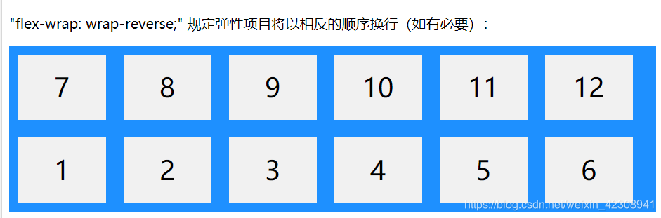
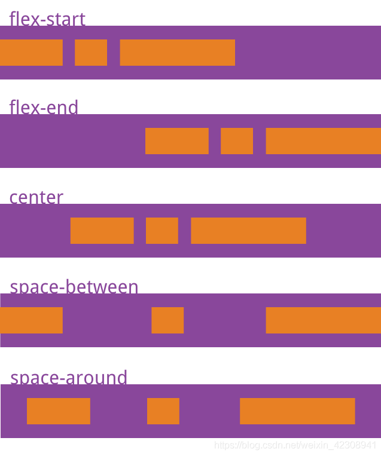
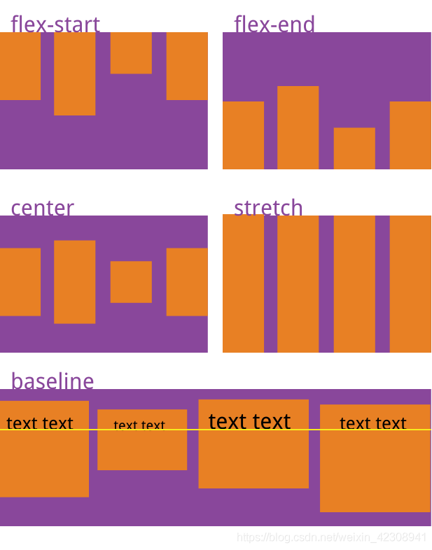
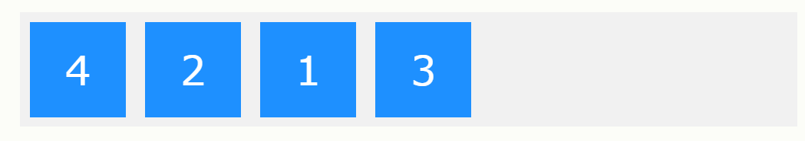
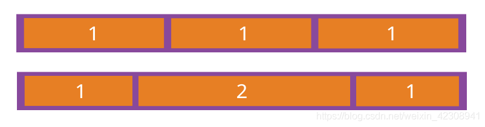
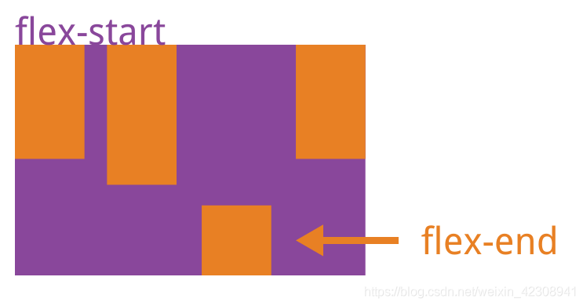

---
nav:
  title: Components
  path: /daily-record
---

# Flex 布局（弹性布局）基本使用方法

## 定义

Flex 是 Flexible Box 的缩写，意为"弹性布局"，用来为盒状模型提供最大的灵活性。采用 Flex 布局的元素，称为 Flex 容器（flex container），简称"容器"。它的所有子元素自动成为容器成员，称为 Flex 项目（flex item），简称"项目" 

## 使用

- 块元素：`disdisplay: flex;`
- 行内元素：` display: inline-flex;`
- Webkit 内核的浏览器：`display: -webkit-flex; /* Safari 必须加上-webkit前缀*/` 

ps:需要注意的是：设为 Flex 布局以后，子元素的 float、clear 和 vertical-align 属性将失效。

## 容器的属性（6 大属性）

- `flex-direction`
- `flex-wrap`
- `flex-flow`
- `justify-content`
- `align-items`
- `align-content`

### flex-direction 属性

flex-direction 属性定义容器要在哪个方向上堆叠 flex 项目（定义**主轴**）。

```c
.box {
  flex-direction: row | row-reverse | column | column-reverse;//共有4个属性值
}
//row 值水平堆叠 flex 项目（从左到右）
//row-reverse 值水平堆叠 flex 项目（但从右到左）  前两个主轴水平方向
//column 值设置垂直堆叠 flex 项目（从上到下）
//column-reverse 值垂直堆叠 flex 项目（但从下到上） 后两个主轴垂直方向
```

### flex-wrap 属性

flex-wrap 属性规定是否应该对 flex 项目换行。

```c
.box{
  flex-wrap: nowrap | wrap | wrap-reverse;
}
//nowrap(默认值)不换行
// wrap换行
//wrap-reverse弹性项目将以相反的顺序换行：
```

  

### flex-flow 属性

flex-flow 属性是 flex-direction 属性和 flex-wrap 属性的简写形式，默认值为 row nowrap。

```c
.box {
  flex-flow: <flex-direction> || <flex-wrap>;
}
```

### justify-content 属性

justify-content 属性定义了项目在**主轴**上的对齐方式。

```c
.box {
  justify-content: flex-start | flex-end | center | space-between | space-around;
}
/*
flex-start（默认值）：左对齐
flex-end：右对齐
center： 居中
space-between：两端对齐，项目之间的间隔都相等。
space-around：每个项目两侧的间隔相等。所以，项目之间的间隔比项目与边框的间隔大一倍。
*/
```



### align-items 属性

align-items 属性定义项目在交叉轴上如何对齐。

```css
.box {
  align-items: flex-start | flex-end | center | baseline | stretch;
  //flex-start：交叉轴的起点对齐。
  //flex-end：交叉轴的终点对齐。
  //center：交叉轴的中点对齐。
  //baseline： 项目的第一行文字的基线对齐。
  //stretch（默认值）：如果项目未设置高度或设为auto，将占满整个容器的高度。
}
```



## 项目（子元素）的属性

### order 属性

order 属性规定 flex 项目的顺序，order 值必须是数字，默认值是 0；数值越小，排列越靠前。

```css
<div class="box">
  <div style="order: 3">1</div>
  <div style="order: 2">2</div>
  <div style="order: 4">3</div>
  <div style="order: 1">4</div>
</div>
```



### flex-grow 属性

flex-grow 属性定义项目的放大比例，默认为 0，即如果存在剩余空间，也不放大。

```css
<div class="box">
  <div style="flex-grow: 1">1</div>
  <div style="flex-grow: 2">2</div>
  <div style="flex-grow: 1">1</div>
</div>
```

 如果所有项目的 flex-grow 属性都为 1，则它们将等分剩余空间（如果有的话）。如果一个项目的 flex-grow 属性为 2，其他项目都为 1，则前者占据的剩余空间将比其他项多一倍。

### flex-shrink 属性

flex-shrink 属性定义了项目的**缩小**比例，默认为**1**，即如果空间不足，该项目将缩小。（**负值**对该属性无效）

如果所有项目的 flex-shrink 属性都为 1，当空间不足时，都将等比例缩小。如果一个项目的 flex-shrink 属性为 0，其他项目都为 1，则空间不足时，前者不缩小。

### flex-basis 属性

flex-basis 属性规定 flex 项目的初始长度。

```css
<div class="box">
  <div>1</div>
  <div>2</div>
  <div style="flex-basis: 200px">3</div>
  <div>4</div>
</div>
//第3个div的初始长度为200px
```

### flex 属性

flex 属性是 flex-grow, flex-shrink 和 flex-basis 的简写，默认值为 0 1 auto。后两个属性可选。

```css
.item {
  flex: none | [ < 'flex-grow' > < 'flex-shrink' >? || < 'flex-basis' > ];
}
```

该属性有两个快捷值：auto (1 1 auto) 和 none (0 0 auto)。建议优先使用这个属性，而不是单独写三个分离的属性，因为浏览器会推算相关值。

```css
.item {
  flex: 1;
}
//flex：1相当于
.item {
  flex-basis: 0%;
  flex-grow: 1;
  flex-shrink: 1;
}
```

### align-self 属性

align-self 属性允许单个项目有与其他项目不一样的对齐方式，可覆盖 align-items 属性。默认值为 auto，表示继承父元素的 align-items 属性，如果没有父元素，则等同于 stretch。该属性可能取 6 个值，除了 auto，其他都与 align-items 属性完全一致。

```css
.item {
  align-self: auto | flex-start | flex-end | center | baseline | stretch;
}
```



以上内容主要参考阮一峰的 Flex 布局教程[教程地址](http://www.ruanyifeng.com/blog/2015/07/flex-grammar.html)
