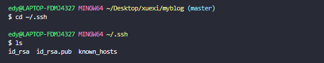
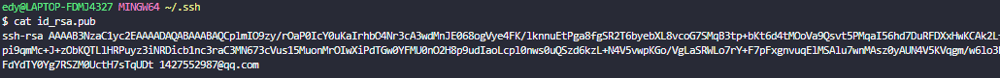
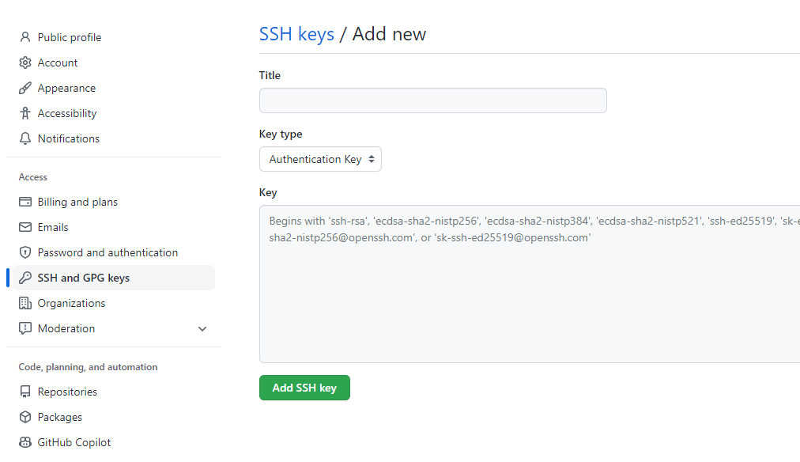
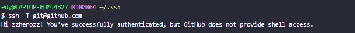

---
nav:
  title: Components
  path: /daily-record
---

## git 使用笔记

### github 配置 ssh key

第一步：检查本地主机是否已经存在 ssh key <br>

```jsx | pure
cd ~/.ssh
ls
//看是否存在 id_rsa 和 id_rsa.pub文件，如果存在，说明已经有SSH Key
```

<br> 第二步：如果有直接跳转到第三步;如果没得,使用命令生成 ssh key,生成完以后再用第一步命令，查看 ssh key <br>

```jsx | pure
ssh-keygen -t rsa -C "xxx@xxx.com"
//执行后一直回车即可
```

第三步：获取 ssh key 公钥内容（id_rsa.pub）<br> 

第四步：Github 账号上添加公钥<br> 

第四步：验证是否设置成功<br>

```jsx | pure

ssh -T git@github.com

```



### 修改本地仓库关联的远程地址

```jsx | pure

git remote set-url origin xxx.git

```

### git 回滚

```jsx | pure
git reset [--soft | --mixed | --hard] [HEAD]

git push -f
```

### git cherry-pick

```jsx | pure
git cherry-pick <commitHash>
git cherry-pick <HashA> <HashB>
git cherry-pick A..B  // 这个不包含A
git cherry-pick A^..B  // 这个包含A
git cherry-pick --continue
//用户解决代码冲突后，第一步将修改的文件重新加入暂存区（git add .），第二步使用下面的命令，让 Cherry pick 过程继续执行。
git cherry-pick --abort
 //发生代码冲突后，放弃合并，回到操作前的样子。
```
