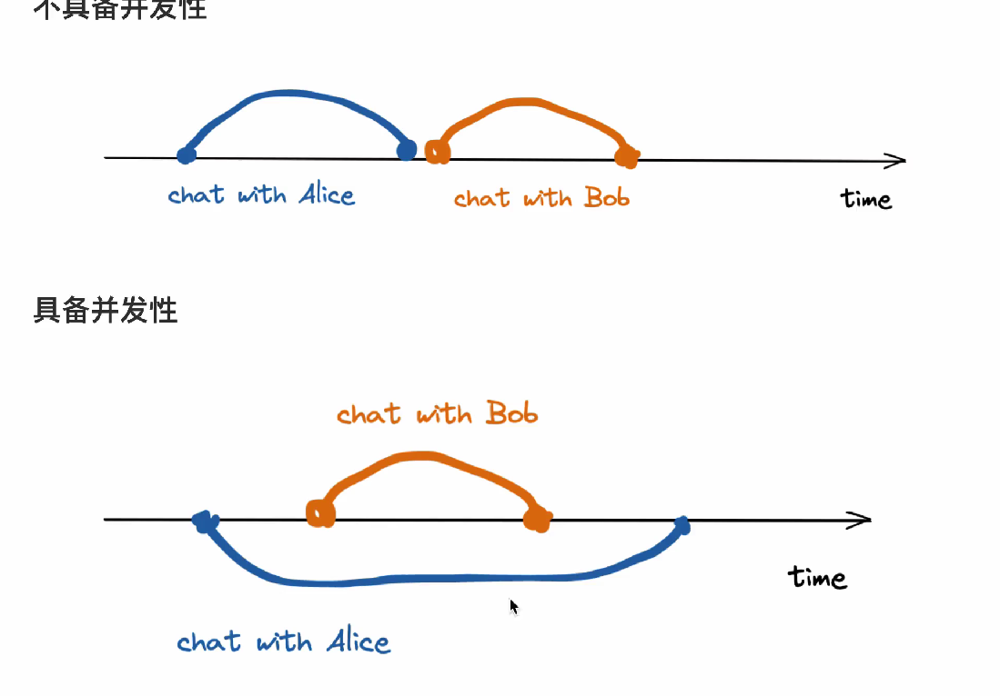
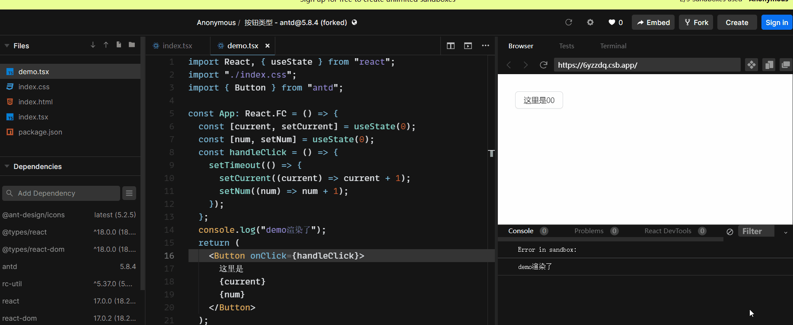
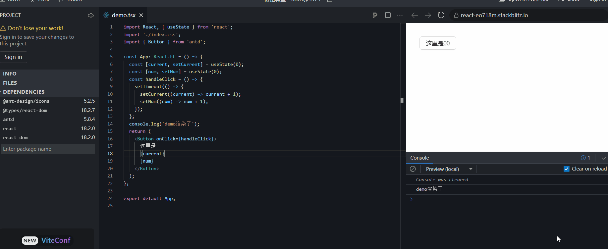
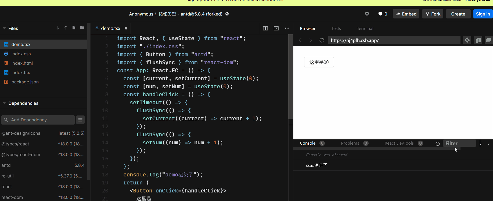
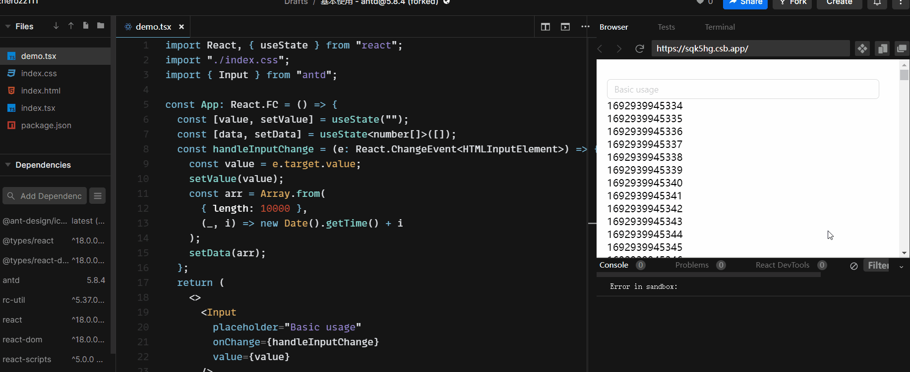
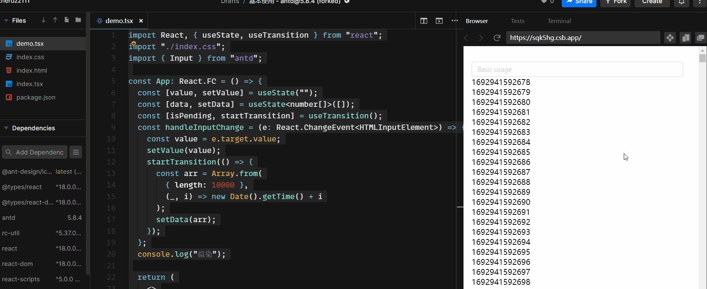

---
nav:
  title: Components
  path: /daily-record
---

### React18 新特性更新

```jsx | pure
//本体
npm install react react-dom --save
//定义文件
npm install @types/react @types/react-dom --save-dev
//升级到最新
npm installl react latest react-domelatest
npm install @types/reactelatest @types/react-domelatest
```

### 新的渲染 Api：creatRoot

新的 api(createRoot)支持并发模式(concurrent mode)的渲染.

- 并发举例： 
- creatRoot 举例

```jsx | pure
// React 17
import React from 'react';
import ReactDOM from 'react-dom';
import App from './App';

const root = document.getElementById('root')!;

ReactDOM.render(<App />, root);

// React 18
import React from 'react';
import ReactDOM from 'react-dom/client';
import App from './App';

const root = document.getElementById('root')!;

ReactDOM.createRoot(root).render(<App />);

```

- 卸载方式的改变

```jsx | pure
// React 17
ReactDOM.unmountComponentAtNode(root);

// React 18
root.unmount();
```

- ts 结合相关的改变

```tsx | pure
// React 18
import React from 'react';

interface IProps {
  content: string;
  children: React.ReactNode;
}
const Button: React.FC<IProps> = ({ children }) => {
  return <div>{children}</div>;
};

export default Button;
```

### 自动批处理

React 18 通过在默认情况下执行批处理来实现了开箱即用的性能改进。批处理是指为了获得更好的性能，在数据层，将多个状态更新批量处理，合并成一次更新（在视图层，将多个渲染合并成一次渲染）。

React 18 之前在原生事件中（setTimeout,promise,监听原生事件等）是没有批处理的,相同的代码 react17 和 react18 的渲染表现是不同的。

```tsx | pure
import { Button } from 'antd';
import React, { useState } from 'react';
import './index.css';

const App: React.FC = () => {
  const [current, setCurrent] = useState(0);
  const [num, setNum] = useState(0);
  const handleClick = () => {
    setTimeout(() => {
      setCurrent((current) => current + 1);
      setNum((num) => num + 1);
    });
  };
  console.log('demo渲染了');
  return (
    <Button onClick={handleClick}>
      这里是
      {current}
      {num}
    </Button>
  );
};
```

- **react17** 
- **react18** 

结论就是 react18 有把原生事件中多次 setState 合并成一次

- **如何推出批处理--flushSync**
- **谨慎使用!!!flushSync**参考文档[flushSync](https://zh-hans.react.dev/reference/react-dom/flushSync)

```tsx | pure
import { Button } from 'antd';
import React, { useState } from 'react';
import { flushSync } from 'react-dom';
import './index.css';
const App: React.FC = () => {
  const [current, setCurrent] = useState(0);
  const [num, setNum] = useState(0);
  const handleClick = () => {
    setTimeout(() => {
      flushSync(() => {
        setCurrent((current) => current + 1);
      });
      flushSync(() => {
        setNum((num) => num + 1);
      });
    });
  };
  console.log('demo渲染了');
  return (
    <Button onClick={handleClick}>
      这里是
      {current}
      {num}
    </Button>
  );
};
```



### Transition

前面讲过 react18 的并发性，并发性就是指具备处理多个任务的能力，但不是在同时处理多个，而是有可能交替的进行处理，按照任何的优先级，每次处理一个任务。

- **useTransition**

```jsx | pure

import React, { useState } from "react";
import "./index.css";
import { Input } from "antd";
const App: React.FC = () => {
  const [value, setValue] = useState("");
  const [data, setData] = useState<number[]>([]);
  const handleInputChange = (e: React.ChangeEvent<HTMLInputElement>) => {
    const value = e.target.value;
    setValue(value);
    const arr = Array.from(
      { length: 10000 },
      (_, i) => new Date().getTime() + i
    );
    setData(arr);
  };
  return (
    <>
      <Input
        placeholder="Basic usage"
        onChange={handleInputChange}
        value={value}
      />
      {data.map((i) => {
        return <div key={i}>{i}</div>;
      })}
    </>
  );
};
export default App;

```



当其中一个 setState 非常耗时的时候，就会阻塞，导致 input 输入框的渲染非常卡顿。这时候就需要 Transition 来把非紧急更新的状态降低优先级

- **应用场景**

* Slow Rendering:当数据量很大的界面渲染，自然要花费更长的时间。
* Slow Network:异步请求，由于需要从外界请求数据，自然有一定的延迟。

```tsx | pure
import { Input } from 'antd';
import React, { useState, useTransition } from 'react';
import './index.css';

const App: React.FC = () => {
  const [value, setValue] = useState('');
  const [data, setData] = useState<number[]>([]);
  const [isPending, startTransition] = useTransition();
  const handleInputChange = (e: React.ChangeEvent<HTMLInputElement>) => {
    const value = e.target.value;
    setValue(value);
    startTransition(() => {
      const arr = Array.from({ length: 10000 }, (_, i) => new Date().getTime() + i);
      setData(arr);
    });
  };
  return (
    <>
      <Input placeholder="Basic usage" onChange={handleInputChange} value={value} />
      {isPending ? (
        <div>等待中...</div>
      ) : (
        data.map((i) => {
          return <div key={i}>{i}</div>;
        })
      )}
    </>
  );
};

export default App;
```



### Suspense Api

- 动态加载异步组件
- 等待异步数据加载

```jsx | pure
<Suspense fallback={<Loading />}>
  <SomeComponent />
</Suspense>
```
