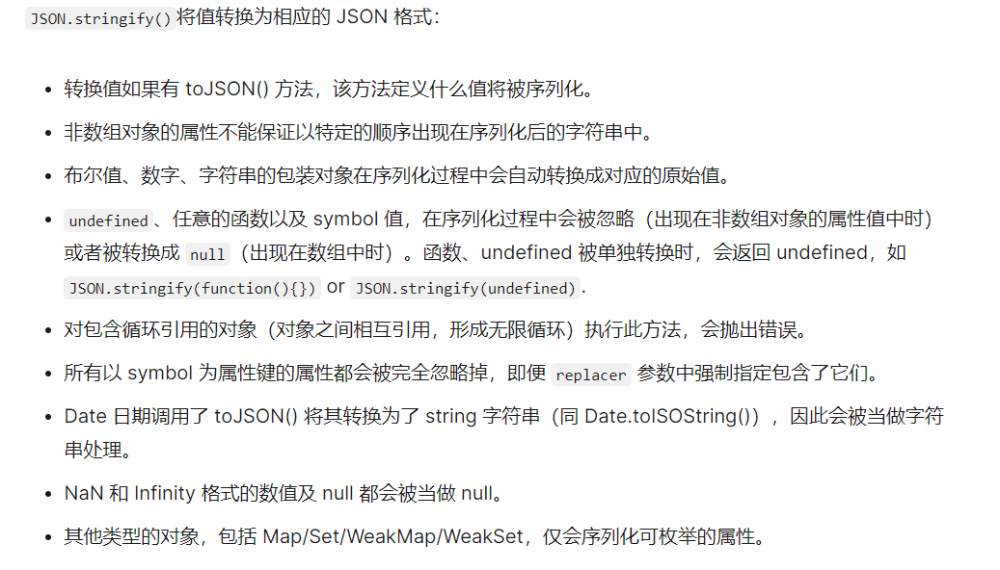

---
nav:
  title: Components
  path: /js
---

## 深拷贝和浅拷贝

浅拷贝和深拷贝都是对于 JS 中的引用类型而言的，浅拷贝就只是复制对象的引用，如果拷贝后的对象发生变化，原对象也会发生变化。只有深拷贝才是真正地对对象的拷贝。

### 浅拷贝

常用的 ES6 中的... ,对象可以使用 Object.assign , 数组可以使用 concat 或是 slice 。

```jsx | pure
const a = { b: 1 };
const b = [1, 2, 3];

// 伪代码
const c = { ...a } / Object.assign({}, a);
const c = [...b] / [].concat(b);
```

这里主要是看对象或者数组有几层，一层一般是深拷贝，但是对象的属性值或者数组里存在引用类型的时候，是浅拷贝。

### 深拷贝

- 1.JSON.parse(JSON.stringify(obj))
- 2.lodash 中的 cloneDeep
- 3.利用递归来实现每一层都重新创建对象并赋值

### JSON.parse(JSON.stringify(obj))

```jsx | pure
const obj1 = JSON.parse(JSON.stringify(obj));
// JSON.stringify(value[, replacer [, space]])
```

使用 JSON.stringify(obj)存在潜在问题的原因是 [JSON.stringify 文档](https://developer.mozilla.org/zh-CN/docs/Web/JavaScript/Reference/Global_Objects/JSON/stringify)



- JSON.stringify 对于 undefined、任意的函数以及 symbol 三个特殊的值分别作为对象属性的值、数组元素、单独的值时 JSON.stringify()将返回不同的结果。

```jsx | pure
// 作为对象属性的值
const obj = {
  a: undefined,
  b: () => 'demo',
  c: Symbol('c'),
  d: 'demo',
};
const obj1 = JSON.parse(JSON.stringify(obj));
console.log(obj1); // {d: 'demo'}

// 作为数组元素
const arr1 = [undefined, () => 'demo', Symbol('c'), 'demo'];
const arr2 = JSON.parse(JSON.stringify(arr1));
console.log(arr2); // [null, null, null, 'demo']

// 作为单独的值
JSON.stringify(() => 'demo');
// undefined
JSON.stringify(undefined);
// undefined
JSON.stringify(Symbol('demo'));
// undefined
JSON.stringify(null);
// null
```

- JSON.stringify 的第二个参数（函数或者数组）和 第三个参数(控制间距)

```jsx | pure
const obj = {
  a: undefined,
  b: () => 'demo',
  c: Symbol('c'),
  d: 'demo',
  e: 'demo1',
  f: 'demo2',
  [Symbol('g')]: Symbol('e'),
};
// 第二个参数作为数组

JSON.stringify(obj, ['e']); // '{"e":"demo1"}'

// 第二个参数作为函数使用
JSON.stringify(obj, (key, value) => {
  if (typeof value === 'undefined') {
    return 'undefined';
  }
  if (typeof value === 'string') {
    return 'a string';
  }
  if (typeof value === 'symbol') {
    return 'a symbol';
  }
  return value;
});
//'{"a":"undefined","c":"a symbol","d":"a string","e":"a string","f":"a string"}'
```

### 利用递归来实现每一层都重新创建对象并赋值

```jsx | pure
const clone = (obj) => {
  if(type of obj ===  'object'){
    let cloneObj = Array.isArray(obj) ? [] : {}
    for(const key in obj){
      cloneObj[key] = clone(obj[key])
    }
    return cloneObj;
  }else {
    return obj
  }
}
```
